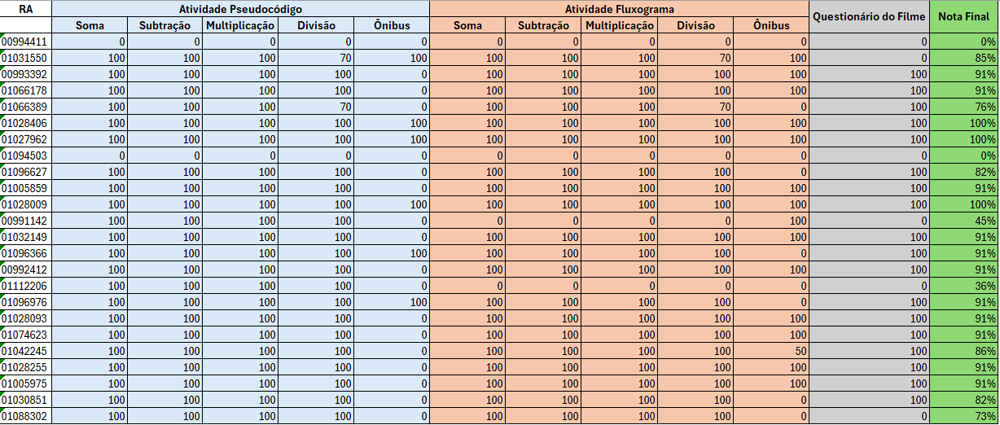

# Quinto Intinerário ADS

Bem-vindo ao repositório do Quinto Intinerário ADS oferecido pelo SENAI! Este repositório contém todos os materiais necessários para as aulas das disciplinas.

## Disciplinas

- **ADS**

## Estrutura dos Diretórios

Cada disciplina possui um diretório próprio onde estarão disponíveis todos os materiais necessários, incluindo aulas, códigos de exemplo, exercícios e provas que serão realizados no decorrer do curso.

```
/Quinto Intinerário ADS
│
├── Ano
│ ├Disciplina 
│ 	├── aulas
│ 	├── exemplos
│ 	├── exercicios
│ 	└── provas
│

```

## Responda o Questionário da Disciplina

https://forms.gle/HDAhZyEnEnZzaXX98

## Calendário

Confira o calendário das disciplinas no arquivo anexo 
[Calendário Irinerário de Formação Técnica e Profissional](Imagens/Calendario_V_Itinerario.pdf).

## Atividades

# Lista de Presença


# Notas Atividades




## Como Usar este Repositório

1. Navegue até a pasta da disciplina desejada.
2. Siga as instruções e utilize os materiais disponíveis para cada aula.

## Contato

Para dúvidas ou mais informações, entre em contato com o professor:
- **Nome do Professor**: Kevin de Souza Guimarães
- **Email**: kevin.guimaraes3561@sesisenaipr.org.br
